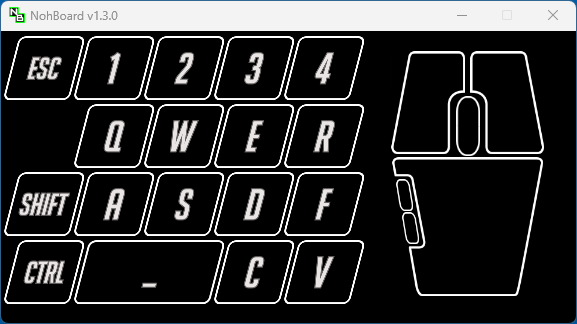

# Input Overlay for The Evil Within

Currently a set of files to create a Noahboard Mouse and Keyboard overlay for The Evil Within, to use with OBS etc.

Inspired by ComicallyBad (https://www.youtube.com/watch?v=LXmwDT2yfwk) adaption for noahboard of the Input Overlay design (https://github.com/univrsal/input-overlay.) This is a new svg version of those bitmap files, not reuse of the original bitmap files. The use of svg should allow easier design choices in the future.

## To use

The ready-to-use files are within the 'noadboard_files' folder. Drop the 'theevilwithin' folder into your noahboard 'keyboards' folder and select it from the noahboard interface. The files are downloadable from the releases as a zip.

There are 2 current layouts - 1 with the mouse direction/speed indicator, and 1 without.

## SVG

All SVG files were created using Inkscape v1.4. Inkscape has a great batch layer export that makes exporting the correctly named png files extremely easy.

Use keyboard_layoutV3-2-2x.svg to create the png files via the batch output. This produces png files the same size as the originally supplied in the ComicallyBad archive.

keyboard_layoutV3-2.svg can be ignored for the time being, but may be used in the future to help layout the keys.

## Scripts

Some experiments to help accurately layout the keys/mouse. Currently using Powershell.

kbd_JSON_2_SVG.ps1: Reads the keyboard.json and creates an svg with the bounding boxes visually represented as rectangles. Really helpful for spotting misaligned objects if the layout was created in the noahboard interface.  An example json and the output svg file are in the same folder.

## Noahboard 

* https://github.com/ThoNoht/NohBoard/releases

## Fonts

* The Evil Within: https://fontmeme.com/fonts/the-evil-within-font/
* BigNoodleTooOblique: https://online-fonts.com/fonts/bignoodletoooblique